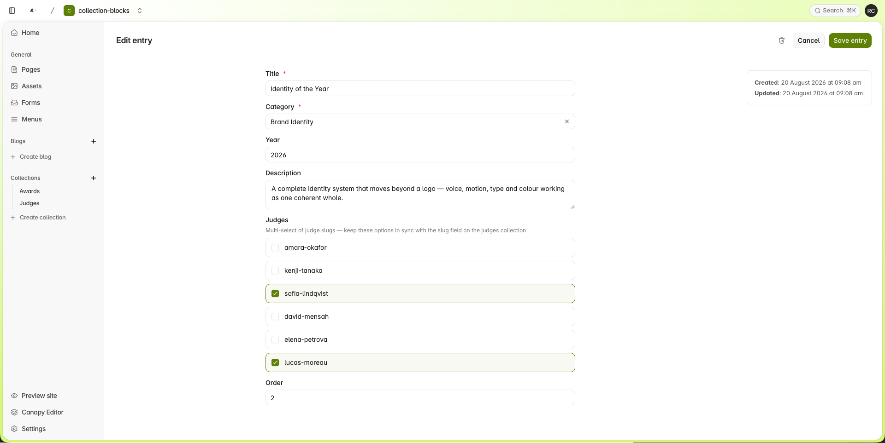
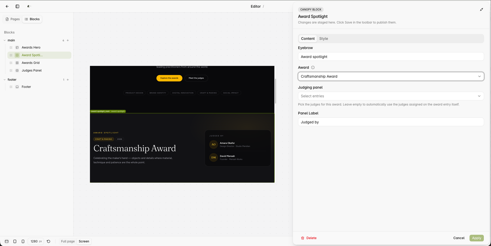

# Collection Blocks — an awards site

An example Blutui project showing how **Canopy Blocks** and **Collections** work together — and
how to relate two collections (**awards** ↔ **judges**) even though Blutui doesn't support
multi-relation links yet.

The demo is a fictional awards site, **The Meridian Awards**, styled with Tailwind CSS v4.

## The idea

An awards site has two kinds of structured content:

- **Awards** — the categories being contested (Product of the Year, Impact Award, …)
- **Judges** — the people who judge them

Each award is judged by *several* judges, and each judge sits on *several* awards — a
many-to-many relationship. Blutui's collection links are single-relation (one entry points at
one entry), so this project demonstrates two ways to model many-to-many today:

1. **Collection-level** — a multi-select field on the award entry, joined by a `filter` in templates
2. **Block-level** — a Canopy block where the editor picks an award entry *and* judge entries, merged in one section

## Technique 1 — multi-select + filter (data lives on the entry)

The `awards` collection has a `judges` **checkbox** field — Blutui's multi-select — whose
options are the `slug` values of entries in the `judges` collection. Editing an award in the
dashboard looks like this:



The entry stores a plain array of slugs:

```json
"judges": ["sofia-lindqvist", "lucas-moreau"]
```

Templates join the two collections with a `filter`:

```canvas
{# award → judges: resolve the panel for one award #}


{# judge → awards: reverse lookup — every award this judge sits on #}

```

- The **Awards Grid** block uses the forward lookup — every award card shows its judging panel
  (avatars + names) resolved live from the slugs.
- The **Judges Panel** block uses the reverse lookup — every judge card lists the awards whose
  multi-select includes their slug.

Because the relationship lives **on the entry**, it's a single source of truth: assign a judge
once in the dashboard and every block that renders that award updates.

**Trade-off:** the checkbox options must be kept in sync with the judge slugs by hand. That's
the price of the workaround until multi-relation links land.

## Technique 2 — entry-select merge (data lives on the block)

The **Award Spotlight** block gives the editor two fields in the Canopy editor and merges them
into one section:

- **Field A** — a single-select `entry` setting locked to the `awards` collection
- **Field B** — a multi-select `entry` setting locked to the `judges` collection (`"multiple": true, "max": 5`)



The config that produces those two pickers:

```json
{ "name": "award",  "type": "entry", "collection": "awards", "display_field": "title" },
{ "name": "judges", "type": "entry", "collection": "judges", "multiple": true, "max": 5 }
```

Here the relationship is **curated per block** — useful when a page needs its own editorial
pairing rather than the canonical one.

The two techniques also compose: when the editor leaves Field B empty, the Spotlight falls back
to Technique 1 and resolves the panel from the award entry's own multi-select field (that's
what's happening in the screenshot — the Craftsmanship Award renders Amara Okafor and David
Mensah without any judges picked in the block):

```canvas


  

```

## Block templates

| Block | File | Demonstrates |
| ----- | ---- | ------------ |
| Awards Hero | `views/canopy/hero.canvas` | Standard settings: `heading`, `url`, `list`, tabs |
| Award Spotlight | `views/canopy/award-spotlight.canvas` | Technique 2, with Technique 1 as fallback |
| Awards Grid | `views/canopy/awards-grid.canvas` | `collection` setting, category `select` filter, forward slug lookup |
| Judges Panel | `views/canopy/judges-panel.canvas` | `collection` setting, reverse slug lookup |
| Footer | `views/canopy/footer.canvas` | Shared block area (`{ shared: true }`) |

## Rendering

- [views/pages/index.html](views/pages/index.html) — the homepage renders a **fixed showcase
  sequence** (`canopy.blocks('main', ['hero', 'award-spotlight', ...])`): every block appears
  immediately with its defaults, and editors can still fill each one in from Canopy.
- [views/layouts/awards.html](views/layouts/awards.html) — a **freeform layout** with an open
  `main` block area for dashboard-created pages, where editors add and arrange blocks themselves.
- Both render a shared `footer` area — add the Footer block once in Canopy and it appears site-wide.

## Collections

### `judges`

| Field | Type | Notes |
| ----- | ---- | ----- |
| `name` | text (required) | |
| `slug` | text (required) | The identifier the awards multi-select points at |
| `role` | text | |
| `company` | text | |
| `bio` | textarea | |
| `photo` | file | Rendered with `image_url`; falls back to an initials avatar |
| `order` | number | Manual sort order |

### `awards`

| Field | Type | Notes |
| ----- | ---- | ----- |
| `title` | text (required) | |
| `category` | select | Product Design · Brand Identity · Digital Innovation · Craft & Making · Social Impact |
| `year` | number | |
| `description` | textarea | |
| `judges` | checkbox | Options are judge slugs — the multi-select "relation" |
| `order` | number | Manual sort order |

Both collections were created and seeded (6 judges, 6 awards) via the Blutui MCP
(`create_collection` / `create_collection_entry` — note the entries endpoint takes the
collection **id**, not its handle).

## Development

```bash
npm install
npm run dev        # Tailwind watcher → public/styles/global.css
courier dev        # local preview at https://localhost:8080
courier push       # upload to Blutui
```
